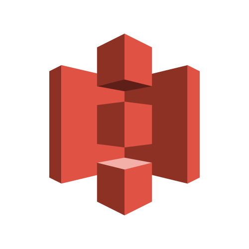

# serverless S3


_Um simples Projeto de upload de arquivo usando s3 da amazon feito pela rockseat_

## Getting Started
Clone o Repositorio e execute os seguintes comandos:

Fora os Comandos é nescessario: 
  - Ter uma conta na AWS;
  - Configurar suas credenciais;
  - Criar a pasta uploads no seu bukect;

```sh
npm install -> install dependecies
serverless config credentials --provider aws --key 1234 --secret 5678 -> Config your credentials AWS,
npm run deploy -> run deploy S3 AWS,
```


<!-- CONTACT -->

## Links

Lucas Lamar - [Github](https://github.com/lucaslamar) - **lucass.lamar@gmail.com** <br>
Video Aula - [Aula](https://www.youtube.com/watch?v=jiP45rEOEbA&t=1487s)